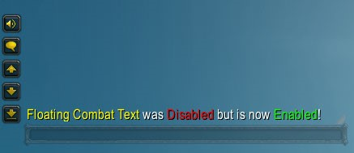

# Floating Combat Text Fix
 

An AddOn designed exclusively to fix a bug that automatically disables the Floating Combat Text feature
Ensures that all FCT related options stay enabled or disabled based on the user's preferences

## Additional Features
* Fully localized
* Slash commands to quickly change FCT's state and options

## Contribute
If you'd like to improve Floating Combat Text Fix by any means, please open an [issue](https://github.com/BrenoLudgero/Floating_Combat_Text_Fix/issues "Issues Tab") with a tag related to your improvement (bug fix, feature request, translation, etc..) or leave a comment in one of the two pages linked to the buttons above
