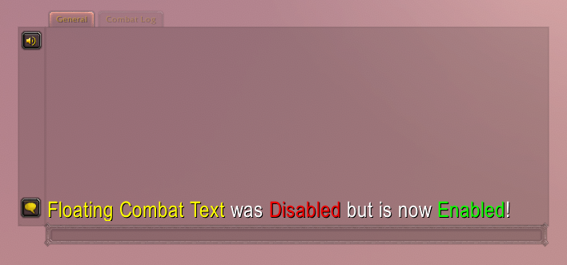
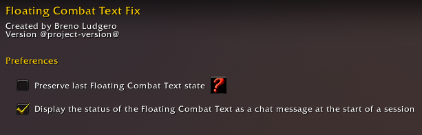

# Floating Combat Text Fix
 

An add-on designed exclusively to fix a bug that automatically disables the Floating Combat Text feature\
Ensures that all FCT related options stay enabled or disabled based on the user's preferences

## Additional Features
* Fully localized
* Slash command to toggle FCT on or off

